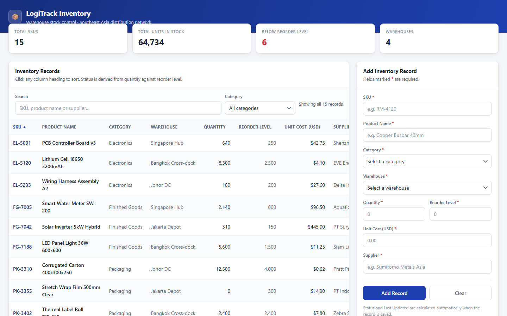

# LogiTrack Inventory

A single-file warehouse stock dashboard for an operations coordinator. One HTML file, no build
step, no server, no dependencies — open it and it works.

**Live demo:** https://keith160110.github.io/Testing/

## Running it

Download [`index.html`](index.html) and double-click it. That's the whole install.

There is nothing to `npm install`, nothing to compile, and no server to start. The page runs
straight from a `file://` origin and makes **zero network requests** — no frameworks, no CDN
links, no web fonts, no analytics.

## What it does

- **Add stock records** through a validated form — SKU, product name, category, warehouse,
  quantity, reorder point, unit cost and supplier. Eight fields, each with its own inline error
  message; SKUs are enforced unique (case-insensitively).
- **Search** across SKU, product name and supplier as you type.
- **Filter** by category, combined with the search box.
- **Sort** every column in both directions, including a Status sort that orders by urgency
  (Out of Stock → Low Stock → In Stock) rather than alphabetically.
- **Derived stock status** — each row is flagged *Out of Stock*, *Low Stock* or *In Stock* by
  comparing quantity against its reorder point. Status is computed on every render, never stored,
  so it can never drift from the numbers behind it.
- **Summary strip** showing totals across the whole warehouse — deliberately unaffected by the
  active search or filter, so it always reflects the true picture rather than the current view.
- **Delete a row** with a written confirmation of what was removed.
- **Responsive layout** — below 900px the panels stack and the table scrolls inside its own card
  instead of widening the page.

## Accessibility

- All feedback goes through a single `aria-live="polite"` status region. There are no
  `alert()`, `confirm()` or `prompt()` dialogs anywhere in the app.
- Validation errors are rendered inline next to the field that caused them and are associated
  with their input, so a screen reader announces the reason rather than a generic failure.
- Sortable column headers expose their current sort direction.
- The table is a real `<table>` with proper headers, not a grid of `
`s.

## How it's built

Everything — markup, CSS and JavaScript — lives inline in `index.html`. The script is organised
into six sections by banner comment:

1. **State** — the `inventory` array is the single source of truth, alongside UI state (search
   text, category filter, sort key and direction) and cached DOM references.
2. **Derivation and formatting** — status calculation, `Intl` number and currency formatters,
   HTML escaping, filter matching.
3. **Render functions** — the table, sort indicators, summary strip and live messages.
4. **Validation** — per-field errors, number parsing, whole-form validation.
5. **Event handlers** — one function per interaction.
6. **Initialisation** — populating selects, binding events, first render.

The data flow is strictly one-directional: **mutate `inventory` → re-render → the DOM is rebuilt
from scratch.** Application data is never read back out of the DOM; a row's `data-id` is a lookup
key into the array, not storage. Because the table body is replaced wholesale on each render,
row-level buttons rely on event delegation. Any user-supplied string is HTML-escaped before it
reaches the DOM.

The category and warehouse lists are defined once as constants and feed both the filter dropdown
and the form's selects.

## Things to know

- **State is in-memory only and resets on reload.** The app uses no `localStorage`,
  `sessionStorage`, IndexedDB or any other storage API, and talks to no backend. Records you add
  or delete live for the life of the page.
- **The seed data is fictional.** The fifteen sample records — SKUs, product names, quantities,
  costs and supplier names — are illustrative sample data created to demonstrate the dashboard.
  They do not represent any real company's inventory, pricing, or supplier relationships, and any
  resemblance to actual trading names is incidental.
